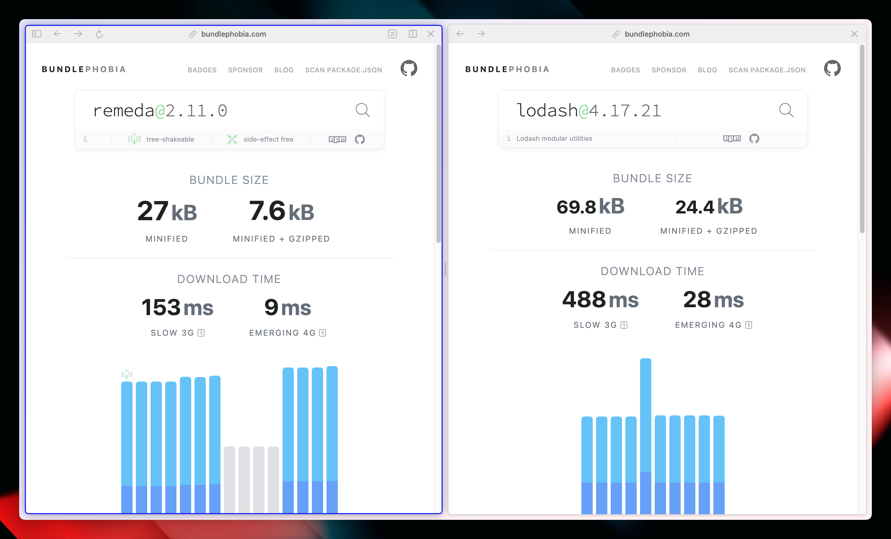

import LinkToCode from "@/components/LinkToCode.astro";
import { Information } from "@/components/Information";

Pour accompagner cet article, je te propose un son que j'ai découvert en l'écrivant et que je kiffe bien :

<iframe style="border-radius:12px" src="https://open.spotify.com/embed/track/7Bf0RPsldDH7jVi9H3wODv?utm_source=generator&theme=0" width="100%" height="152" frameBorder="0" allowfullscreen="" allow="autoplay; clipboard-write; encrypted-media; fullscreen; picture-in-picture" loading="eager" title="Spotify embed player"></iframe>

Je dis souvent lors des formations TypeScript que je donne que le meilleur TypeScript que l’on produit, c’est celui que l’on n’écrit pas.
Ce que j’entends par là, c’est que le meilleur moyen de profiter de TypeScript, c’est de profiter de son inférence de types, parce qu'on ne va pas se mentir, personne n'aime maintenir des types.
Un des autres moyens d'écrire du bon TS, c'est d'éviter d'écrire du code spécifique à TypeScript comme, par exemple, les `enum` ou les `namespace` qui sont une feature en plus qui devra être traduit en JavaScript, mais qui ne se fait pas du tout en 1 pour 1.

La meilleure manière de produire une application web écrite en TS, c’est de mettre les types robustes au plus bas, ce qui est bien souvent la couche HTTP dans une application web, car il faut valider les entrées et sorties de notre application.
Entrées, ça veut aussi dire les formulaires pour vérifier les entrées utilisateur·ice·s.

Et pour cela, commençons par la première bibliothèque que j’utilise en ce moment (depuis quelques temps maintenant, mais ça fait quelques années que je n’ai pas écrit d’article).

## zod

Si tu es développeur·euse web, que tu fais du développement en TypeScript et que tu ne connais pas encore `zod`, je t’invite fortement à lire la suite !
`zod` est un outil permettant de faire des schéma de validation en TypeScript et de profiter d’une inférence de type statique, je m’en sers pour valider les données que je reçois d’une API, ce qui me permet de voir que le contrat est respecté au runtime, mais également de profiter du typage statique lors du développement.

Voyons ensemble mes conventions de déclarations de schéma en prenant pour exemple le modèle de personnage de l’[API de Rick et Morty](https://rickandmortyapi.com/documentation#character) :

```ts
import { z } from "astro:content";

export const zCharacter = () =>
  z.object({
    id: z.number().int().positive(),
    name: z.string(),
    status: z.enum(["Alive", "Dead", "unknown"]),
    species: z.string(),
    type: z.string(),
    gender: z.enum(["Female", "Male", "Genderless", "unknown"]),
    origin: z.object({
      name: z.string(),
      url: z.string().url(),
    }),
    location: z.object({
      name: z.string(),
      url: z.string().url(),
    }),
    image: z.string().url(),
    episode: z.array(z.string().url()),
    url: z.string().url(),
    created: z.date(),
  });

const data = {
    "id": 361,
    "name": "Toxic Rick",
    "status": "Dead",
    "species": "Humanoid",
    "type": "Rick's Toxic Side",
    "gender": "Male",
    "origin": {
        "name": "Alien Spa",
        "url": "https://rickandmortyapi.com/api/location/64"
    },
    "location": {
        "name": "Earth",
        "url": "https://rickandmortyapi.com/api/location/20"
    },
    "image": "https://rickandmortyapi.com/api/character/avatar/361.jpeg",
    "episode": [
        "https://rickandmortyapi.com/api/episode/27"
    ],
    "url": "https://rickandmortyapi.com/api/character/361",
    "created": "2018-01-10T18:20:41.703Z"
}

const myCharacter = zCharacter().parse(data);
```
<LinkToCode
  href="https://www.typescriptlang.org/play/?#code/JYWwDg9gTgLgBAbzgLzgXzgMyhEcBEyEAJvgNwBQFApgB6SxwDGEAdgM7zIDCAFgIZR+TGNShwAvHAAUASkkA+CnBQA6CACMAVtRHSEylXGDEAXGtYBXEBrFzVwVjHuR2wGMABu1OQBpDKqz8INTmyKqcUI4A5n4BcJz8MJbsYarUViDSANr4AIIANl7U+L4EACLU-KRl+JasANasEADurPgAurL+RglgusDUqWqRMXG9MACe-WmjrLHd8dEZxGJpGdY5+ABi1CD8BSW1ALIHRwQA4itih+zspQT1Ta3tXT1G0MDRjmmaOnoGXqBYKhEYwKLzcZAyxQAqzcFjWSqGEFKEqNCLXoFCBMJLANi-bS6ZyAoFBELwiELd69FGUxHI2Fo9CYoygfjLemQpEo5nUMDAdgkUHhQRCSbScJzBaM1GyVkqOlgqn2XkK5hQKqiMxqYhJHysjGUCgsDjwPUwfiSRDxfAmfDmADMADYAIw0gjkkrmfAAFQgtGATDgACUgw1SrbEsl7j7KtVI718Ox+kxBrGCAAJaz8Zr2j34Kb9B0EMNMBoAcnYcH9geDAGUTEdbctWKsoCX8KdDomjPhPt92uZSUDPSDO4VBqw4PWwPxe6O6rDO7wYDAwKkAPSbqLl3PEEDQKb8AWqFggTcn4Cb7G4jxsTfOgAs+HiaALt7xbBLI6B+C9nYAKKCDAvALn+KIrmuG6mNuu4NPuh6wJMV5nrgl4CjeOJfqwm4AEwAAyvr0762uyyxQeuW47uGiFHihp7nhh15MAIQgiGIl6eEkgibi6rqqFo-TROB+D8oKwoltk8RJquVGwTRe5tkhx6MehV6buJQqrPhADsxFGB0BaQT6ckwXBtHKfRqFMRprGCMIohQHxbqiUwmr6qQPqEa6AAcAC0BGuv5roEb6fmmIRphPgJukEY6ABar5oFQpqcHAICTHwDkceIUg8Gxjl2Eic5QOwPgWvwsiUKO25wAAegA-EAA"
>Lien vers le Playground TypeScript avec ce code</LinkToCode>

On voit donc la convention en `zMonEntite` sous forme de fonction pour garder le concept de base de zod et de pouvoir passer d’éventuels paramètres à l’avenir.

Suite à la déclaration du schéma, je l'utilise pour _parser_ directement les données que je reçois dans mes services, ce qui me permet de profiter de l’inférence de type dans ces services et de profiter du typage de bout en bout jusqu’à mes pages dans lesquelles j’utilise mes [`useQuery`](https://tanstack.com/query/latest/docs/framework/react/reference/useQuery) (de [TanStack Query](https://tanstack.com/query/latest)) déclarés et inférés.

Ces schémas me servent également à valider mes formulaires depuis que j’utilise React Hook Form, bien pratique car mes données sont directement validées à partir des entrées utilisateur·ice·s jusqu’à l’API.

Je ne vais pas faire le tour de toute les fonctionnalités de `zod` dans cet article car ce serait bien trop long, mais je t’invite fortement à le tester dans un [Playground TypeScript](https://www.typescriptlang.org/play).

<Information>Il est possible d’utiliser des dépendances dans les Playground TypeScript, écrit l’import et ça va aller récupérer la dépendance automatiquement pour que tu puisses jouer avec directement dans le Playground.</Information>

## Boxed

Une lib que j’utilise un peu moins mais que je trouve bien pratique de temps en temps, qui s’inspire de la programmation fonctionnelle, c’est [Boxed](https://swan-io.github.io/boxed/) par l’équipe de chez [Swan](https://www.swan.io/).

Elle permet de mettre en place des structures relativement classique pour faire de la programmation fonctionnelle, ce qui me rappelle [mes petites sessions de Rust](https://www.bearstudio.fr/blog/developpement/rust). On y retrouve `Result`, bien pratique dans le cas de l'écriture d'une fonction pour laquelle on a de la gestion d'erreur et `Option` pour les fonctions les plus basses pour lesquelles on retournerait par exemple `null`, `undefined`.
Ces dernières sont deux “valeurs” que je tente de retirer de plus en plus de mon code pour m’assurer une _type-safety_ au maximum.

Une autre structure que j’aime beaucoup, et que j’ai utilisé encore récemment chez un client, c’est `AsyncData` qui permet d’avoir plusieurs états asynchrone et de gérer une logique différente en fonction des cas:

* `NotAsked`: pas d’action de la part des utilisateur·ice·s (ou pas d’action tout court)
* `Loading`: action asynchrone en cours, permet de gérer des états de loading
* `Done(value)`: l’action est terminée et on peut récupérer la valeur encapsulée dans la structure

Bref, c’est pas mal de petites chose qui vont t’aider pour que ta base de code soit la plus _type-safe_ possible.
Cette structure gère également une interopérabilité avec la prochaine dépendance que je vais te présenter : `ts-pattern` !

## TS Pattern

Quand j’ai essayé Rust pour la première fois, j’ai adoré le _pattern matching_, c’est une structure de contrôle de donnée que je ne connaissais pas, et voilà que je la retrouve en TypeScript grâce à cette lib ! C’est bien pratique, et je vais tout de suite t’expliquer pourquoi !

Pas plus tard que le jour où je rédige ces lignes, je suis tombé sur le bout de code suivant:

```ts
const displayValue = value === undefined
  ? '---'
  : value === true
  ? 'true'
  : value === false
  ? 'false'
  : value;
```

Plusieurs problèmes:

1. C’est difficilement lisible
2. C’est difficilement maintenable
3. On couvre peut être pas tous les cas qui correspondent au type de `value` et on est même pas averti

C’est dans ce genre de cas que `ts-pattern` entre en jeu, en voici un exemple avec du code avant / après:

```ts
import { match, P } from 'ts-pattern';

type MyComponentProps = { value?: boolean | string | number };

const MyComponent = ({ value }: MyComponentProps) => {
  // Ternaire
  const displayValue = value === undefined
    ? '---'
    : value === true
    ? 'true'
    : value === false
    ? 'false'
    : value;

  // Pattern Matching
  const d = match(value)
    .with(undefined, () => '---')
    .with(true, () => 'true')
    .with(false, () => 'false')
    .with(P.number, P.string, (v) => v)
    .exhaustive()
}
```
<LinkToCode href="https://www.typescriptlang.org/play/?#code/JYWwDg9gTgLgBAbziAhjAxgCwDRwApwC+cAZlBCHAOQwDOAtGGjAKZQB2VA3AFA8wBPMCzgBZAQGEKkdi3Yw85MLTgBeRHABuKADYBXFgH4AXHABGECDpYp2cAD5xaMKMHYBzB3HZ6QZtkS8POgQ7M5iktKhcvDqABRI2voihKbiUuDR8ooQygCUagB8iDxwcAD05XAAKmzsKMBQLKVwIWHwACbAtGA6KAIAaroGalrDIqqTcHrsHSwkbiwdLWWG1PQbVCtwpkkjk+ouBttrNFAGW2Vlu+NqUyS6tM1XcKcPOk+XVzfJQWWV+GYdTEaCwbncLTa4Q6o1QGEwcT2LDy2wAdAB3YAwBEzOYLWQdXBxAqqYpUDb0Kgol4YrEIo4sIkkskMqlozHYuLvJ5MorUbksNk0jkIvConx+Ni4MXOVweImaZlaalXVEsAAemBQemcwE0LGJPEIQA">Lien vers le Playground TypeScript avec ce code</LinkToCode>

On le voit directement, c’est notamment dans le `.exhaustive()` que réside la puissance de `ts-pattern`, car il nous permet de couvrir tous les cas et types de la variable, en effet, `.exhaustive()` va avoir un soucis de typage si on a oublié de gérer un des types de la variable.

Prenons un autre exemple avec du code de [🚀 Start UI [web]](https://github.com/BearStudio/start-ui-web), un starter de projet dont je suis un des contributeurs.
On a un composant `Select` qui nous permet de gérer [différent type de `select`](https://github.com/BearStudio/start-ui-web/blob/4745ab66edb5c377102ff02292433039e3d33b0b/src/components/Select/index.tsx#L37-L43): `async`, `creatable`, `async-creatable` et le `select` classique.
L’avantage de `ts-pattern` ici par rapport à un `switch` natif, c’est encore une fois de ne pas oublier de cas.
On est sûr que si un·e développeur·euse ajoute un type de `Select`, alors TypeScript et `ts-pattern` ne valideront pas ces lignes et nous dirons qu’il y a un cas en plus à gérer.

Encore une fois, je t’invite vraiment à voir tout ce qu’il est possible de faire avec cette lib, y a beaucoup de fonctionnalités sympa qui méritent le détour !

## Remeda

Je vais te la faire courte, `remeda`, c’est `lodash` écrit en TypeScript pour TypeScript.
En prenant le code suivant, on se rends vite compte de la force de `remeda` par rapport à `lodash` ou bien les fonctions natives JavaScript (avec le typage fourni par l'équipe de TypeScript) :

```ts
import { keys } from "remeda";
import { keys as lodashKeys } from "lodash";

const Routes = {
    Home: {
        label: "Home",
        link: "/",
    },
    About: {
        label: "About",
        link: "/about"
    }
}

// Typed ✅
const keyValues = keys(Routes);

// Poorly typed 😔
const keyValuesObject = Object.keys(Routes);

// Poorly typed 😔
const keyValuesLodash = lodashKeys(Routes);
```
<LinkToCode
  href="https://www.typescriptlang.org/play/?ssl=25&ssc=14&pln=1&pc=1#code/JYWwDg9gTgLgBAbzgawKYE8DOcC+cBmUEIcA5FKiKgCYCGpA3AFCiSyIoba3YA2EdTAAsA0l1wEiJUv0FDGTJgGMIAO0zwAShACuMVNgC8iJnDNwAEsVQAuE+YdxetAEapedgERWqngDSmjma8wKrIXgD0-oFmOAEOAIIuujB2CDGOzm4ecJ5JKdFBwaHhuRGuBRk4TNVMERFwACroYDRwgKDkymoanOgAarS8OgZwxmhYABTaegYAlMxFcPVwAHoA-IrLAAoQ0LzocDAtbYC8G4Aoe13q8OMDQwYA8i4AVqhK8MaPL28AdOOYUyk5gsist1psGjs9gcjq1qHBzpcejdBsNMAAZAQ8ISjJyY4RiSbTfSYeYZBygtZAA"
>Lien vers le Playground TypeScript avec ce code</LinkToCode>

De plus `remeda` va être un peu plus léger que `lodash` (alors oui, il y a un peu moins de fonctions, mais j’avoue que pour l’instant, j’ai jamais manqué de fonctions avec `remeda`) ce qui est fortement appréciable.



Niveau API, je trouve ça bien sympa : soit on est en mode _data-first_ ce qui est plus naturel pour les devs, en mode appel de fonction sur les données et traitement en deuxième genre `map(data, () => {})`, soit on est en mode _data-last_ grâce aux fonctions qui acceptent le [currying](https://stackoverflow.com/questions/36314/what-is-currying#36321), ce qui permet de faire plusieurs traitements de suite grâce à la fonction `.pipe()` par exemple.

## Mention spéciale: nuqs

Marre des sites qui ne gardent pas la pagination comme il faut ou ne gardent pas les informations de filtre et recherche quand tu recharges la page ?
La faute aux personnes qui implémentent les sites avec des états en mémoire et pas dans l'URL parce qu'elles sont ignorantes, ou parce qu'elles trouvent ça galère de gérer le typage et la logique pour le faire. 

C'est là que [`nuqs`](https://nuqs.47ng.com/) entre en jeu !
C'est une dépendance pour Next.js qui va te permettre de gérer tes états dans l'URL, tout en aillant un fort typage avec de la (dé)sérialisation.
Tu n'as plus aucune raison de ne pas utiliser l'URL pour gérer les états qui le mérite !

Si tu veux en savoir plus sur `nuqs`, je t'invite à aller voir [la conférence (en anglais _my dear_) de son développeur François Best](https://www.youtube.com/watch?v=6hD2SPP1eus).

<iframe width="560" height="315" src="https://www.youtube.com/embed/6hD2SPP1eus?si=rmFoiakpV0YG20uR" title="YouTube video player" frameborder="0" allow="accelerometer; autoplay; clipboard-write; encrypted-media; gyroscope; picture-in-picture; web-share" referrerpolicy="strict-origin-when-cross-origin" allowfullscreen loading="lazy"></iframe>

J’espère que cet article t’a plu ! Dans tous les cas, n'hésite pas à me le faire savoir sur X ou autres réseaux disponible dans le bas de page.
Si jamais tu veux un article détaillé sur l'une des dépendances que j'ai présenté ici, fais le moi savoir et je verrais ce que je peux faire.

A plus.
